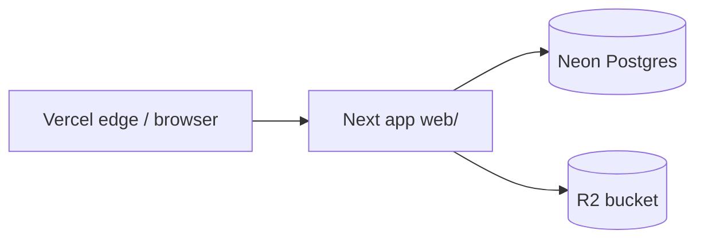

# Demo Deployment Runbook (Vercel + Neon + Cloudflare R2)

This runbook deploys the `web/` app as a client-shareable demo using:
- App hosting: Vercel
- Database: Neon Postgres
- File storage: Cloudflare R2 (S3-compatible)
- Access model: seeded credentials (admin + client)
- DNS target: subdomain (recommended), e.g. `demo.clientdomain.com`

---

## 0) Architecture and why we chose it

### 0.1 What runs where

| Layer | Choice | Role |
|--------|--------|------|
| **App** | Next.js 16 (App Router) in `web/` | Server-rendered UI, API routes, Auth.js |
| **Auth** | Auth.js v5 (`web/src/auth.ts`) | Credentials login + optional GitHub; JWT sessions; Prisma adapter for user linkage |
| **ORM** | Prisma 7 + Postgres adapter | Schema in `web/prisma/schema.prisma`; client generated to `web/src/generated/prisma` |
| **Database** | **Neon** | Managed Postgres; connection string `DATABASE_URL`; no Docker in production |
| **Object storage** | **Cloudflare R2** | S3-compatible private bucket; uploads/downloads via `@aws-sdk/client-s3` in app code |
| **Hosting** | **Vercel** | Builds `web/`, runs serverless Node for API/RSC; env vars from Vercel dashboard |
| **Demo access** | Seeded users | `web/prisma/seed.ts` — admin + one or many clients via `SEED_*` env vars |

### 0.2 Request flow (mental model)



- **HTML / RSC / server actions** hit the Next deployment on Vercel.
- **Auth** uses `AUTH_SECRET` and `AUTH_URL` (must match the public URL you hand to clients).
- **Files** are not stored on Vercel disk in production: `STORAGE_PROVIDER=r2` sends bytes to R2; metadata stays in Postgres (`FileAsset.storageKey`).

### 0.3 Implementation touchpoints (so you remember where to look)

| Concern | Location |
|---------|-----------|
| R2 vs local disk | `web/src/lib/storage/project-files.ts` (`STORAGE_PROVIDER` = `local` \| `r2`) |
| Upload + DB row | `web/src/lib/data/file-assets.ts` |
| Download route | `web/src/app/api/projects/[id]/files/[fileId]/route.ts` |
| Env examples | `web/.env.example`, `web/.env.production.example` |

### 0.4 Decisions record (alternatives we did *not* pick)

| Decision | Chosen | Why not the other |
|----------|--------|-------------------|
| **App host** | Vercel | Render free tier sleeps; Railway is credit-based long-term; Vercel matches Next.js |
| **DB** | Neon | Free tier Postgres; works with Prisma; Supabase DB alone is fine too but Neon is simple for “just Postgres” |
| **Files** | R2 | Local disk breaks on Vercel (ephemeral); Firebase Storage is fine but R2 + S3 API matches `DESIGN.md` and keeps server-side code portable |
| **Domain** | Subdomain `demo.<domain>` | Easiest SSL + single A record to Vercel; apex needs different DNS patterns |
| **Client demo auth** | Seeded email/password | No OAuth setup for the client; GitHub OAuth optional via `AUTH_GITHUB_*` |

### 0.5 Live demo reference (this deployment — no secrets here)

These are **identifiers**, not credentials. Secrets live only in Vercel / Neon / Cloudflare dashboards.

| Item | Value |
|------|--------|
| Vercel project | `whobrey-studios-demo` (team: your Vercel team / `mwhobreys-projects`) |
| Public demo URL | `https://demo.whobreystudios.llc` |
| Vercel fallback URL | `https://whobrey-studios-demo.vercel.app` |
| Repo app root | `web/` |
| R2 bucket name (example) | `whobreystudios` |
| DNS for subdomain | **A** record `demo` → `76.76.21.21` (Vercel-recommended at time of setup) |

**SSL note:** After adding DNS, Let’s Encrypt may fail until propagation reaches validators; wait and re-run alias/cert or redeploy from Vercel if needed.

---

## 1) Prerequisites

You need active accounts for:
- Vercel
- Neon
- Cloudflare (with R2 enabled)
- GitHub (repo connected to Vercel)

Local tools:
- Node 20+
- npm
- Git

## 2) Environment Variables (Production)

Set these in Vercel Project Settings -> Environment Variables (Production):

| Variable | Required | Example | Source |
|---|---|---|---|
| `DATABASE_URL` | yes | `postgresql://...` | Neon project connection string (pooled) |
| `AUTH_SECRET` | yes | 64+ random chars | Generate locally (`node -e "console.log(require('crypto').randomBytes(32).toString('hex'))"`) |
| `AUTH_URL` | yes | `https://demo.clientdomain.com` | Final production URL |
| `MAX_UPLOAD_BYTES` | optional | `52428800` | Keep default or raise/lower |
| `STORAGE_PROVIDER` | yes | `r2` | Explicitly set to R2 in production |
| `STORAGE_BUCKET` | yes | `whobrey-demo-files` | Cloudflare R2 bucket name |
| `STORAGE_ENDPOINT` | yes | `https://<accountid>.r2.cloudflarestorage.com` | Cloudflare R2 API endpoint |
| `STORAGE_REGION` | yes | `auto` | Cloudflare R2 default |
| `STORAGE_ACCESS_KEY_ID` | yes | `...` | Cloudflare R2 API token key id |
| `STORAGE_SECRET_ACCESS_KEY` | yes | `...` | Cloudflare R2 API token secret |
| `SEED_ADMIN_EMAIL` | optional | `admin@whobrey.local` | Seed override |
| `SEED_ADMIN_PASSWORD` | optional | `strong-demo-password` | Seed override |
| `SEED_CLIENT_EMAILS` | optional | `client1@…,client2@…` | Comma-separated list (preferred for multiple demo clients) |
| `SEED_CLIENT_EMAIL` | optional | `client@whobrey.local` | Single client (legacy; ignored if `SEED_CLIENT_EMAILS` is set) |
| `SEED_CLIENT_PASSWORD` | optional | `strong-demo-password` | Shared password for all seeded clients |
| `STRIPE_SECRET_KEY` | yes (payments) | `sk_test_...` | Stripe Dashboard → Developers → API keys (test mode) |
| `STRIPE_WEBHOOK_SECRET` | yes (payments) | `whsec_...` | Stripe CLI (`stripe listen`) or Dashboard webhook signing secret |
| `NEXT_PUBLIC_STRIPE_PUBLISHABLE_KEY` | optional | `pk_test_...` | Same API keys page; hosted Checkout works without it in v1 |

Notes:
- `STORAGE_PROVIDER` defaults to local mode in development if not set.
- `STORAGE_ENDPOINT` may be pasted with or without a path; the app normalizes to the **origin only** (bucket name is always `STORAGE_BUCKET`).
- Do not commit real secrets to `.env` in git.

## 3) Provision Services

### 3.1 Neon
1. Create a new Neon project for this demo.
2. Copy the pooled connection string.
3. Put it in Vercel as `DATABASE_URL`.

### 3.2 Stripe (sandbox / demo payments)

1. Accept developer access on the Whobrey Studios Stripe account (test mode ON).
2. Copy test keys into Vercel (and local `web/.env`):
   - `STRIPE_SECRET_KEY` = `sk_test_...`
   - `NEXT_PUBLIC_STRIPE_PUBLISHABLE_KEY` = `pk_test_...` (optional)
3. **Webhooks**
   - **Local:** `stripe listen --forward-to localhost:3000/api/webhooks/stripe` → use printed `whsec_...` as `STRIPE_WEBHOOK_SECRET`.
   - **Production:** Dashboard → Developers → Webhooks → Add endpoint:
     - URL: `https://<AUTH_URL-host>/api/webhooks/stripe`
     - Events: `checkout.session.completed`, `checkout.session.expired`
     - Signing secret → `STRIPE_WEBHOOK_SECRET` in Vercel.
4. Ensure `AUTH_URL` matches the public app URL (Checkout return URLs depend on it).

**E2E smoke (WHO-31):** approve quote → pay deposit (card `4242424242424242`) → admin advances project → pay final → download final file.

### 3.3 Resend (auth magic links + transactional email)

1. Create a Resend account and API key → `RESEND_API_KEY` in Vercel / local `web/.env`.
2. Add and verify sending domain **`whobrey-studios.llc`** (SPF/DKIM records at your DNS host).
3. Set `EMAIL_FROM` e.g. `Whobrey Studios <portal@whobrey-studios.llc>`.
4. **Outbox worker (WHO-22):** set `CRON_SECRET` and schedule something to call the drain route:
   - Path: `GET` or `POST` `https://<your-domain>/api/cron/email-outbox`
   - Header: `Authorization: Bearer <CRON_SECRET>`
   - Optional query: `?batchSize=20` (max 100)
   - **Vercel Hobby:** built-in Cron is limited to **once per day** (no `*/5` schedules). We do **not** ship a Vercel cron in `web/vercel.json` for that reason.
   - **Recommended (demo):** [cron-job.org](https://cron-job.org) (or similar) — free tier can hit the URL every 5 minutes with the Bearer header.
   - **Optional Vercel Pro:** add to `web/vercel.json`: `"crons": [{ "path": "/api/cron/email-outbox", "schedule": "*/5 * * * *" }]`
   - Local drain: `cd web && npm run verify:email-outbox` (needs `DATABASE_URL`; Resend keys optional — rows stay pending if unset).
5. Dev without domain verify: Resend onboarding domain works for test sends only.

**E2E smoke (WHO-7):**

1. Guest submit at `/request` → admin email (new request) via cron drain.
2. Client magic link at `/login` → project links to account.
3. Admin sends quote → `contactEmail` receives quote email (even before link).
4. `npm run verify:email-outbox` or hit cron route to drain queue.
5. Stripe deposit → client + admin payment emails.

### 3.4 Auth rate limits (WHO-28)

Magic-link and studio login attempts are counted in Postgres (`AuthRateLimit`). Defaults: 5 magic-link emails / 15 min per address; IP buckets are higher. No extra env vars required.

### 3.5 Cloudflare R2
1. Create bucket (private): `whobrey-demo-files` (or your chosen name).
2. Create an R2 API token with object read/write permissions for that bucket.
3. Copy:
   - Access Key ID -> `STORAGE_ACCESS_KEY_ID`
   - Secret Access Key -> `STORAGE_SECRET_ACCESS_KEY`
   - Account endpoint -> `STORAGE_ENDPOINT`
4. Set:
   - `STORAGE_PROVIDER=r2`
   - `STORAGE_BUCKET=<bucket-name>`
   - `STORAGE_REGION=auto`

## 4) Deploy to Vercel

1. Push your branch to GitHub.
2. In Vercel: Add New Project -> import this repo.
3. Framework preset: Next.js (auto-detected).
4. **Root Directory → `web`** (required — not the repo root).  
   If you see *"No Next.js version detected"*, this step was skipped or reset.
5. Add all environment variables from section 2.
6. Trigger initial production deploy.

### 4.1 Vercel project settings (demo)

| Setting | Value |
|---------|--------|
| Framework Preset | Next.js (auto after root dir is `web`) |
| Root Directory | **`web`** |
| Build Command | *(default)* `npm run build` |
| Install Command | *(default)* `npm install` |
| Output Directory | *(default)* Next.js |

`web/vercel.json` is intentionally empty of crons on **Hobby** — use an external scheduler (see §3.3).

## 5) Database Setup (Migrate + Seed)

**Neon was likely created with `db push`** (no Prisma migration history). Do **not** run `migrate deploy` on that DB until you baseline (P3005) or use `db push` below.

From local machine, set production DB URL:

```powershell
$env:DATABASE_URL="postgresql://<neon-connection-string>"
cd web
```

### 5.1 Sync schema (recommended for demo Neon)

Adds missing columns (`shopUrl`, `AuthRateLimit`, `EmailOutbox`, etc.) without migration history:

```powershell
npm run db:push
npm run db:seed
```

### 5.2 Optional — enable `migrate deploy` on prod later

Only if you want `_prisma_migrations` tracking after schema already matches `schema.prisma`:

```powershell
npm run db:push
npm run db:baseline
```

After baseline, future releases can use `npm run db:deploy` against prod before deploy.

### 5.3 Greenfield Neon (empty database)

```powershell
npm run db:deploy
npm run db:seed
```

**Vercel builds** use `next build` only (no DB access at build time). Apply schema changes to Neon manually with §5.1 or §5.3 before redeploying.

## 6) Custom Domain (Subdomain Recommended)

Target: `demo.clientdomain.com`

1. In Vercel -> Project -> Domains -> add `demo.clientdomain.com`.
2. In your DNS provider, create the record Vercel shows. For many registrars, **subdomain = A record**:
   - Host/name: `demo`
   - Value: `76.76.21.21` (Vercel anycast; confirm in Vercel UI if this changes)
3. Wait for **global** DNS propagation (try [dnschecker.org](https://dnschecker.org)); Let’s Encrypt can fail with `NXDOMAIN` until resolvers see the record.
4. Update `AUTH_URL=https://demo.clientdomain.com` in Vercel env vars.
5. Redeploy production once `AUTH_URL` is set to the final domain (or run `npx vercel alias set <production-url> demo.clientdomain.com` from `web/` if cert was stuck).

If apex/root domain is required later, follow Vercel’s apex record instructions (often A/ALIAS depending on DNS host).

## 7) Verification Checklist

Run these checks after deployment:

1. App loads at `https://demo.clientdomain.com`.
2. Log in with seeded admin credentials at `/login`.
3. Log in with seeded client credentials at `/login`.
4. Admin can open `/admin/projects`.
5. Client can open `/portal`.
6. Upload a draft file on a project.
7. Download the same file (verifies read path).
8. Redeploy once, then verify the uploaded file is still downloadable (proves R2 persistence).
9. Verify unauthorized access is denied across roles.

## 8) Rollback Procedure

1. Open Vercel Deployments.
2. Locate last known-good deployment.
3. Click Promote to Production (instant rollback).
4. Re-run smoke tests from section 7.

If rollback was data-related:
- Use Neon backup/snapshot restore as needed.
- Keep R2 objects untouched unless corruption requires cleanup.

## 9) Demo Credential Sharing Template

Use this when sending to client:

```text
Demo URL: https://demo.clientdomain.com

Client Login:
Email: <client email>
Password: <client password>

Notes:
- This is a demo environment for review and workflow walkthrough.
- Data can be reset between sessions if requested.
```

## 10) Known Caveats

- Upload storage is backed by R2 when `STORAGE_PROVIDER=r2`; local disk mode remains only for development (`STORAGE_PROVIDER` unset or `local`).
- Demo auth is seeded credentials only (no public signup). Multiple clients: use `SEED_CLIENT_EMAILS` (comma-separated) in Vercel if you re-seed from CI or local.
- If DNS/SSL is still propagating, clients may temporarily see cert errors, `NXDOMAIN`, or failed challenges — wait globally, then retry alias/cert in Vercel.
- Vercel build may warn about NFT tracing involving `project-files.ts`; it does not block deploy.

## 11) Further reading

- Product/design intent and long-term stack notes: [DESIGN.md](../DESIGN.md) at repo root
- Local dev and defaults: [README.md](../README.md)
