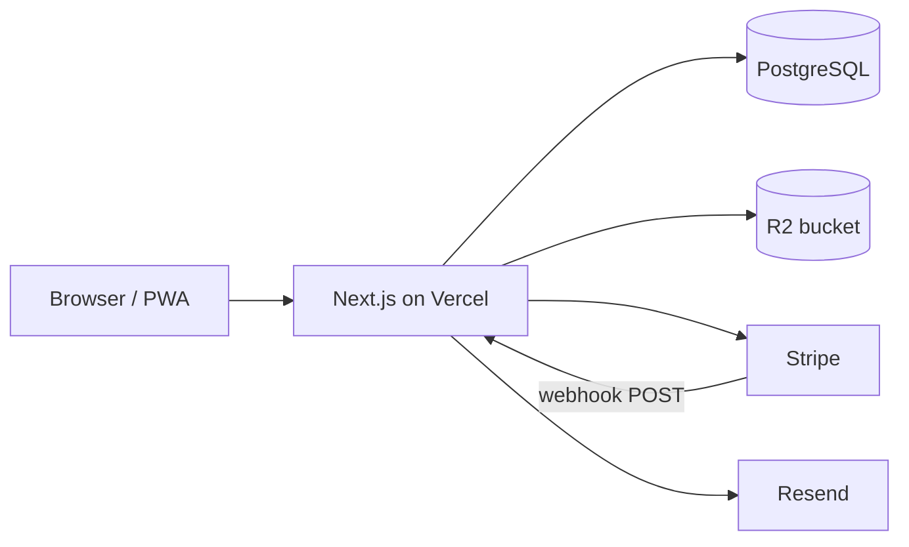
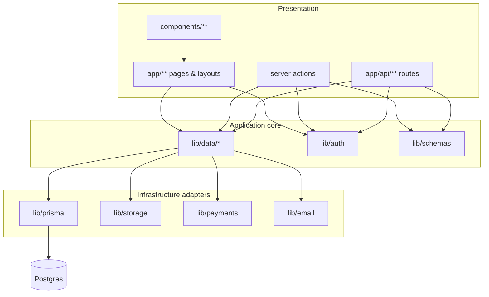
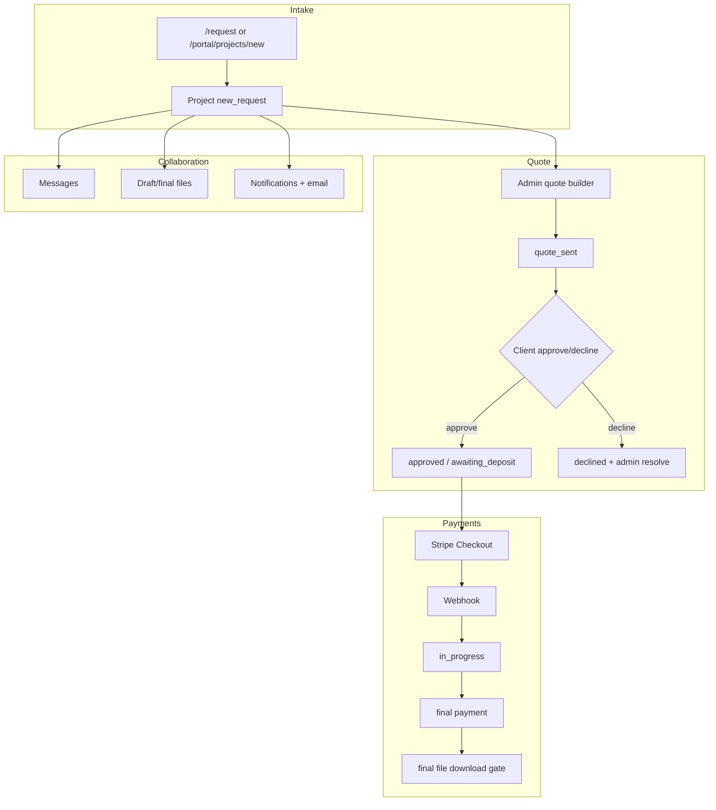

# Architecture

How the Whobrey Studios system is designed, what it connects to, and how data moves through it.

**See also:** [00_INDEX.md](./00_INDEX.md) · [02_COMPONENTS_AND_FILES.md](./02_COMPONENTS_AND_FILES.md) · [DESIGN.md](../../DESIGN.md)

---

## Tech stack

| Layer | Technology | Version / notes |
|-------|------------|-----------------|
| **Language** | TypeScript | Strict mode via `web/tsconfig.json` |
| **UI framework** | React | 19.x |
| **App framework** | Next.js (App Router) | 16.x — **not** the Next.js from most training data; see `web/AGENTS.md` |
| **Styling** | Tailwind CSS | v4 via `@tailwindcss/postcss` |
| **Database** | PostgreSQL | 16 locally (Docker); **Neon** in production |
| **ORM** | Prisma | 7.x — client generated to `web/src/generated/prisma` (gitignored) |
| **Auth** | Auth.js v5 (`next-auth`) | Config in `web/src/auth.ts`; app uses `@/lib/auth` façade |
| **Validation** | Zod | Shared schemas in `web/src/lib/schemas/` |
| **Payments** | Stripe | Checkout Sessions + signed webhooks |
| **Email** | Resend | Magic links + transactional; outbox + Vercel cron worker |
| **Object storage** | Local disk / Cloudflare R2 | S3-compatible via `@aws-sdk/client-s3` |
| **Hosting** | Vercel | App root directory = `web/` |
| **Issue tracking** | Linear | Team `WHO` |

**Root repo** (`package.json` at git root) only orchestrates local dev via `scripts/dev.mjs`. All application dependencies live in `web/package.json`.

---

## System design patterns

This is **not** microservices. It is a **modular monolith** — one Next.js deployment with strict internal layering.

### Pattern summary

| Pattern | How we use it |
|---------|----------------|
| **Layered architecture** | UI → server actions / API → `lib/data` → Prisma → Postgres |
| **Adapter / ports** | Payments (`PaymentAdapter`), storage (`STORAGE_PROVIDER`), email (Resend + outbox) — swappable without touching pages |
| **Façade** | `@/lib/auth` hides Auth.js from the rest of the app |
| **Repository-style data layer** | `lib/data/*.ts` owns all DB reads/writes and authorization |
| **Server-first rendering** | React Server Components by default; client components only when needed |
| **Event fan-out (async)** | Business events → in-app `Notification` + optional `EmailOutbox` row → cron drain |
| **Webhook-driven state** | Payment truth comes from Stripe webhooks, not client callbacks |
| **Explicit state machine** | `ProjectStatus` transitions enforced in `lib/data/projects.ts` |
| **Outbox pattern** | Email sends queued in `EmailOutbox`; worker retries on failure |

We do **not** use: Redux/global client state stores, GraphQL, message queues (Inngest/BullMQ) yet, or real-time WebSockets for chat.

---

## High-level runtime diagram



### Environments

| Environment | App host | Database | Files |
|-------------|----------|----------|-------|
| **Local** | `localhost:3000` | Docker Postgres (`docker-compose.yml`) | `web/storage/uploads` |
| **Demo / prod** | Vercel | Neon | Cloudflare R2 |

---

## Layering (dependency rules)



**Rules:**

1. UI never talks to Prisma directly.
2. UI never imports `@/auth` for session checks — use `@/lib/auth`.
3. Authorization runs on the server for every mutation and sensitive read.
4. External service details stay inside adapter modules.

---

## Data flow

### 1. How data enters

| Entry point | What gets created | Path |
|-------------|-------------------|------|
| Guest intake `/request` | `Project` (+ optional intake `FileAsset`) | Server action → `lib/data/projects.ts` |
| Client intake `/portal/projects/new` | `Project` with `clientUserId` | Same |
| Admin quote builder | `Quote`, `QuoteLineItem` | `lib/data/quotes.ts` |
| File upload | `FileAsset` + bytes in storage | `lib/data/file-assets.ts` → `lib/storage/project-files.ts` |
| Messages | `Message` (threaded) | `lib/data/messages.ts` |
| Stripe webhook | `PaymentRecord` update, status transition | `lib/payments/webhook-handler.ts` |
| Auth sign-in | Session JWT; guest projects linked by email | `lib/auth/link-client-projects.ts` |

All external input is parsed with **Zod** before touching the data layer.

### 2. How data mutates

| Domain | Mutation hub | Notable rules |
|--------|--------------|---------------|
| **Projects** | `lib/data/projects.ts` | `transitionProjectStatus` validates allowed edges; writes `ProjectStatusTransition` audit row |
| **Quotes** | `lib/data/quotes.ts` | Versioned per project; send/approve/decline updates quote + project status |
| **Payments** | `lib/data/payments.ts` | Idempotent via `stripeEventId`; never trust client "paid" flags |
| **Files** | `lib/data/file-assets.ts` | Promote draft → final; download gates check payment state |
| **Notifications** | `lib/data/notifications.ts` | Best-effort create; fans out to email via `lib/email/fanout.ts` |

Side effects (email enqueue, notifications) use **best-effort** helpers so primary transactions still commit if email fails.

### 3. How data leaves

| Exit | Mechanism |
|------|-----------|
| **HTML/RSC to browser** | Next.js server render + streaming |
| **JSON API** | `/api/projects`, `/api/notifications`, etc. |
| **File download** | Authorized GET → signed URL or streamed bytes from storage |
| **Email** | Resend API (direct for magic links; outbox worker for transactional) |
| **Stripe** | Checkout redirect (user leaves app briefly, returns via success URL) |

No public bucket listing. Files always go through authz-checked routes.

---

## Domain model (conceptual)

**Schema source:** `web/prisma/schema.prisma`

### Core entities

| Model | Role |
|-------|------|
| `User` | Auth.js user + `role` (`admin` \| `client`) + optional `passwordHash` |
| `WorkspaceSettings` | Singleton policies: revision default, deposit %, legal/shop URLs |
| `ServiceType` | Admin-editable project type labels |
| `Project` | Job record + status + contact fields |
| `Quote` / `QuoteLineItem` | Versioned pricing |
| `Message` | Threaded project discussion |
| `FileAsset` | File metadata (bytes in object storage) |
| `PaymentRecord` | Stripe session / webhook tracking |
| `Notification` | In-app bell feed |
| `EmailOutbox` | Async email queue |
| `ProjectStatusTransition` | Status change audit log |

### Project status machine (implemented enum)

```
new_request → quote_sent → approved → awaiting_deposit → in_progress
  → final_revision → awaiting_final_payment → completed

Branches: declined, on_hold, cancelled
```

Logic: `canTransitionProjectStatus`, `transitionProjectStatus` in `lib/data/projects.ts`.

**Note:** `DESIGN.md` §4.2 describes a richer future status list (consultation, proof_sent, etc.). The DB enum above is what ships today.

### Quote lifecycle

`QuoteStatus`: `draft` → `sent` → `approved` | `declined`  
Multiple versions per project; UI uses latest via `getLatestQuoteForProject`.

---

## External dependencies & third-party APIs

| Service | Purpose | Config vars | Integration location |
|---------|---------|-------------|----------------------|
| **PostgreSQL** | System of record | `DATABASE_URL` | `lib/prisma.ts` |
| **Auth.js** | Sessions, credentials, magic link | `AUTH_SECRET`, `AUTH_URL` | `src/auth.ts` |
| **GitHub OAuth** (optional) | Extra login provider | `AUTH_GITHUB_ID`, `AUTH_GITHUB_SECRET` | `src/auth.ts` |
| **Stripe** | Deposit + final payments | `STRIPE_SECRET_KEY`, `STRIPE_WEBHOOK_SECRET`, `NEXT_PUBLIC_STRIPE_PUBLISHABLE_KEY` | `lib/payments/*`, `api/webhooks/stripe` |
| **Resend** | Email + magic links | `RESEND_API_KEY`, `EMAIL_FROM` | `lib/email/resend.ts` |
| **Cloudflare R2** | Production file storage | `STORAGE_PROVIDER=r2`, `STORAGE_*` | `lib/storage/project-files.ts` |
| **Vercel Cron** | Email outbox worker | `CRON_SECRET` | `api/cron/email-outbox` |
| **Neon** | Managed Postgres (prod) | `DATABASE_URL` (pooled) | Prisma |
| **Linear** (dev tooling) | Issue tracking via MCP | `LINEAR_DEFAULT_TEAM=WHO` | Cursor MCP, not runtime |

### Webhook & cron endpoints

| Endpoint | Caller | Auth |
|----------|--------|------|
| `POST /api/webhooks/stripe` | Stripe | Signature verification (`STRIPE_WEBHOOK_SECRET`) |
| `POST /api/cron/email-outbox` | Vercel cron | `Authorization: Bearer $CRON_SECRET` |

---

## Security architecture (non-negotiables)

From `DESIGN.md` §5:

1. **Server-side authorization** on every mutation — clients see only their projects.
2. **Private file storage** — downloads through authorized routes; final files gated on payment when configured.
3. **Webhook-confirmed payments** — idempotent `stripeEventId` on `PaymentRecord`.
4. **Secrets in env only** — no secret keys in client bundles (Stripe publishable key is the exception).
5. **Guest project linking** — `contactEmail` matched on first client sign-in.

---

## Product workflow (end-to-end)



---

## Deferred architecture (phase 2+)

| Item | Linear / doc | Notes |
|------|--------------|-------|
| In-app shop / cart | WHO-10 | External `shopUrl` in settings for now |
| SMS / native push | WHO-11 | In-app bell + email today |
| Google OAuth for clients | DESIGN §8 | Magic link + password seed today |
| Native iOS/Android | decisions A1/A2 | PWA-first |
| Background job queue | DESIGN §3 | Outbox + cron sufficient for v1 |
| Rich status enum expansion | DESIGN §4.2 | Prototype-inspired checkpoints |
| Real-time chat | DESIGN §7 | Threaded async messages today |
