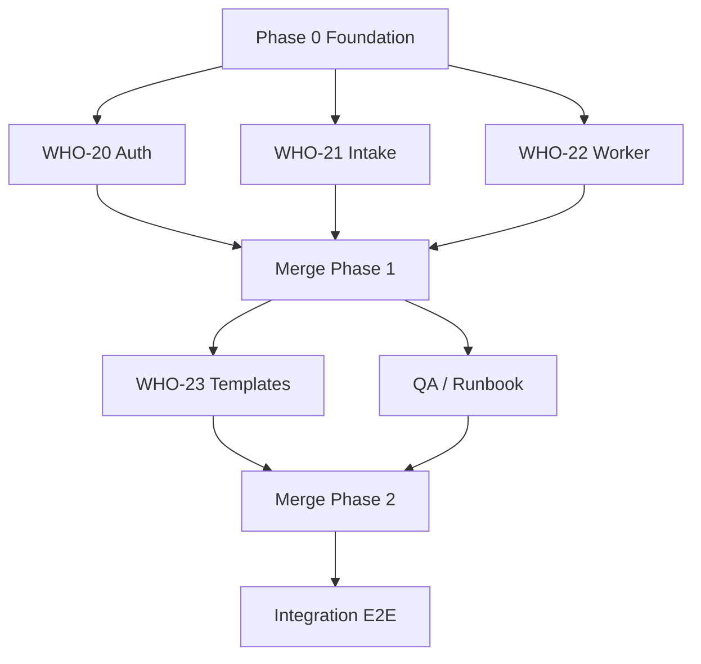

# WHO-7 — Auth & transactional email — implementation plan

**Linear epic:** [WHO-7](https://linear.app/whobrey-studios/issue/WHO-7)  
**Milestone:** P1-T2 — Auth & email  
**Status:** In Progress (decisions locked 2026-05-21)

## Product source

| Source | Decision |
|--------|----------|
| `decisions_complete.md` B1 | Client **magic link**; Google later |
| `decisions_complete.md` B2 | Admin **password** now |
| `decisions_complete.md` F1 (doc default) | **Email + in-app** for v1 |
| `decisions_complete.md` F1 (client note) | SMS/push wanted → **WHO-11** (Phase 3), not WHO-7 |

## Engineering defaults (locked)

| Area | Choice |
|------|--------|
| Email provider | **Resend** |
| From domain | **`@whobrey-studios.llc`** — e.g. `Whobrey Studios <portal@whobrey-studios.llc>` |
| Intake | **Guest intake** — no login to submit request |
| Linking | **WHO-21** — on first magic-link sign-in, set `clientUserId` on projects with matching `contactEmail` |
| Login routes | `/login` (client magic link) · `/login/studio` (admin password) |
| Delivery | **Postgres `EmailOutbox` + cron** (`/api/cron/email-outbox`, `CRON_SECRET`) |
| Inngest | **Not v1** — upgrade when we need schedules, digests, SMS/push workers, or painful cron retries |

### Environment

```env
RESEND_API_KEY=re_...
EMAIL_FROM="Whobrey Studios <portal@whobrey-studios.llc>"
CRON_SECRET=...
AUTH_URL=https://portal.whobrey-studios.llc   # must match public URL for magic links
```

Resend: verify domain `whobrey-studios.llc` (SPF/DKIM) before production sends.

---

## Child issues

| Issue | Title | Phase |
|-------|--------|-------|
| [WHO-20](https://linear.app/whobrey-studios/issue/WHO-20) | Client magic link + login split | 1 (parallel A) |
| [WHO-21](https://linear.app/whobrey-studios/issue/WHO-21) | Guest intake + contactEmail linking | 1 (parallel B) |
| [WHO-22](https://linear.app/whobrey-studios/issue/WHO-22) | Email outbox + cron worker | 1 (parallel C) |
| [WHO-23](https://linear.app/whobrey-studios/issue/WHO-23) | Email templates + event map | 2 (parallel D) |

---

## Multi-agent execution plan

### Phase 0 — Foundation (sequential, 1 agent, ~0.5 day)

**Blocks everything.** Single PR to `main` before parallel work.

- [ ] `web/src/lib/email/resend.ts` — send helper, `isEmailConfigured()`
- [ ] `web/prisma` — `EmailOutbox` model + migration
- [ ] `web/src/lib/email/outbox.ts` — `enqueueEmail()` (insert pending row only)
- [ ] `web/.env.example` — `RESEND_API_KEY`, `EMAIL_FROM`, `CRON_SECRET`
- [ ] `docs/demo-deployment-runbook.md` — Resend domain + cron stub

**Commit:** `WHO-7 :sparkles: feat(email): Resend adapter and outbox schema`

---

### Phase 1 — Parallel (3 agents after Phase 0 merges)



#### Agent A — WHO-20 (auth)

**Owns:** `web/src/auth.ts`, `web/src/app/login/**`

- [ ] Add Auth.js `Email` provider; `sendVerificationRequest` → Resend
- [ ] `/login` — client: email + “Send link” (no password)
- [ ] `/login/studio` — admin: credentials only
- [ ] `signIn` callback: reject magic link for `role: admin` or users with `passwordHash`
- [ ] Update redirects / marketing links to `/login` vs `/login/studio`
- [ ] Seed note: demo clients can remain password-based locally; prod clients magic-link only

**Does not touch:** intake form, outbox processor, templates

**Handoff to B:** expose hook `onClientFirstSignIn(userId, email)` in auth callbacks for linking (or B patches same callback in a coordinated second commit)

---

#### Agent B — WHO-21 (guest intake + linking)

**Owns:** intake route, `projects.ts` data layer, project authz

- [ ] Public or semi-public intake: e.g. `/request` or ungate `/portal/projects/new` only
- [ ] `insertProject` — allow `clientUserId: null`, always persist `contactEmail`
- [ ] `linkProjectsByContactEmail(userId, email)` — call from auth sign-in (coordinate with A)
- [ ] `getProjectForViewer` / mutations — authz: owner **or** matching `contactEmail` while unlinked
- [ ] Post-submit copy: “Check your email…”
- [ ] Admin list still shows projects with no `clientUserId`

**Does not touch:** login UI, Resend templates, cron route

---

#### Agent C — WHO-22 (outbox worker)

**Owns:** `web/src/lib/email/outbox.ts` (processor), cron API, runbook

- [ ] `processEmailOutbox(batchSize)` — Resend send, update status, retry cap
- [ ] `POST /api/cron/email-outbox` — `Authorization: Bearer ${CRON_SECRET}`
- [ ] Idempotency: respect `idempotencyKey` unique constraint
- [ ] Runbook: Vercel cron schedule (e.g. every 5 min), Resend dashboard
- [ ] Optional: `npm run verify:email-outbox` dev script

**Does not touch:** `auth.ts`, templates (WHO-23), intake UI

---

**Phase 1 merge order:** A + B may conflict on `auth.ts` — **merge A first**, then B rebases linking into callbacks. C is usually clean.

---

### Phase 2 — Parallel (2 agents after Phase 1)

#### Agent D — WHO-23 (templates)

**Owns:** `web/src/lib/email/templates/**`, notification fan-out hooks

- [ ] Template components or HTML strings per `templateKey`
- [ ] Map events → template + recipients (see WHO-23 description in Linear)
- [ ] **Fix:** `quote_sent` emails `contactEmail` even when `clientUserId` is null
- [ ] Call `enqueueEmail()` beside `createNotificationsBestEffort` in data layer

#### Agent E — QA / docs

- [ ] Runbook § P1-T2 E2E: guest intake → magic link → admin sends quote → client receives email → pay (Stripe)
- [ ] Document Resend sandbox vs production domain
- [ ] Linear: comment on WHO-7 with E2E results

---

### Phase 3 — Integration (1 agent)

- [ ] Full manual E2E on local stack + Stripe CLI + Resend test mode
- [ ] WHO-28 follow-up: rate limit magic-link requests (defer unless trivial)

### Phase 2 status

- [x] WHO-23 templates + `fanOutEventBestEffort` wired to notification hooks
- [x] Outbox processor uses HTML templates (replaces JSON placeholder)

---

## Inngest — when we would add it

| Today (WHO-7) | With Inngest later |
|---------------|-------------------|
| Cron drains `EmailOutbox` | `inngest.send('email/queued')` with automatic retries/backoff UI |
| Inline Stripe webhook side effects | Optional: webhook ACK fast, function handles notify + email |
| — | Scheduled quote reminders, admin digests |
| — | WHO-11 SMS/push delivery workers |

Not required for studio-scale transactional volume at launch.

---

## Definition of done (epic)

1. Client can submit request **without** an account, then sign in via magic link and see the project.
2. Admin receives **email** on new request (in-app + email).
3. Client receives **email** when quote is sent (including pre-link `contactEmail`).
4. Payment webhook triggers client/admin payment emails.
5. Resend domain verified for `@whobrey-studios.llc` in production runbook.
